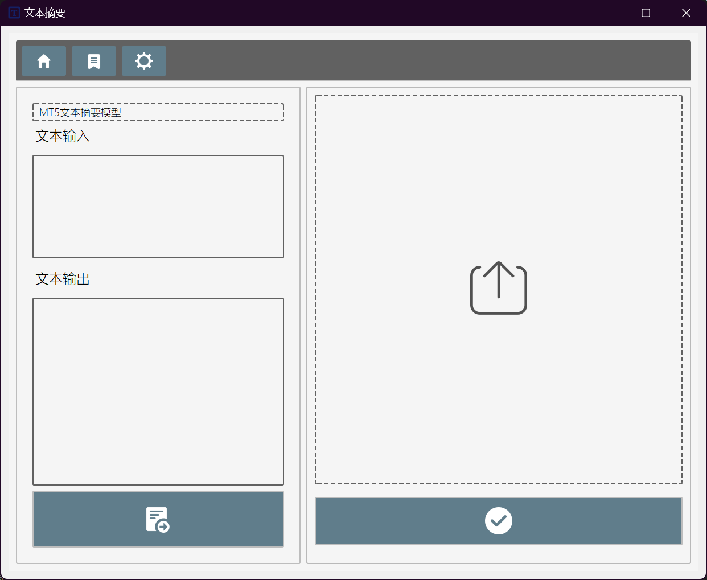
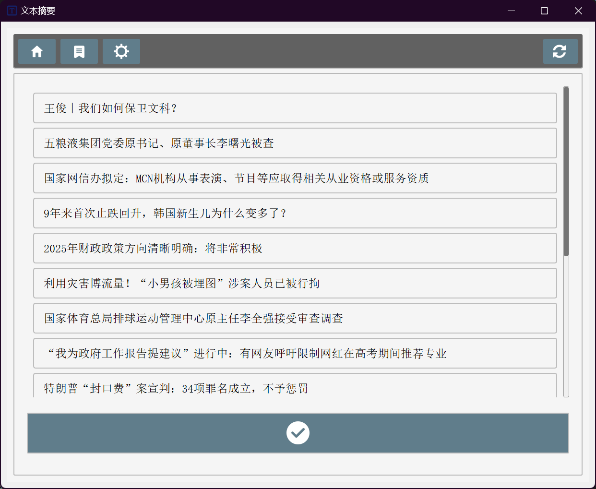
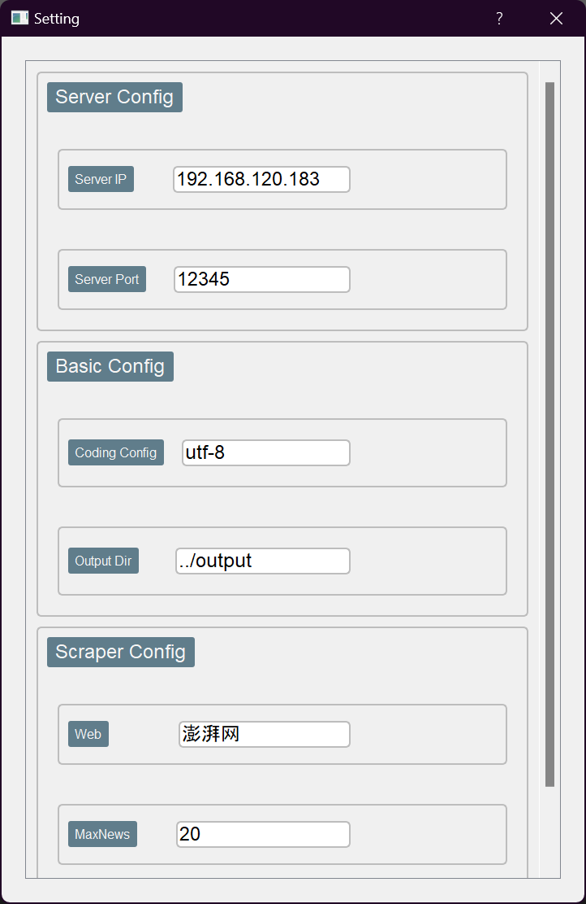

# 文本摘要应用的前端部分
###### 以及一个够不完善的服务端

该项目采用前后端分离的结构 前后端通过SOCKET API进行通信 通信内容为明文传输的字符串
项目内置了一个多线程爬虫(有修改为协程爬虫的潜力)负责去一些新闻网站上爬取热搜 性能中规中矩 但是可以被软件实时性所接受 完成响应20个界面并进行些许处理的情况下 完整启动模式(生命周期中仅使用一次)使用1.3s-4s 非完整启动模式(linkDict更新)使用约0.7s 

目前可配置的新闻网站

- 央视网国内
- 央视网国外
- 澎湃网


GUI部分使用 PyQt5 designer进行设计 用户端部分使用MVC模式组织代码 服务端部分只提供最为基本的多线程用于响应客户端的请求 并未添加其余功能 因此后端部分需要进行些许个性化修改

对于用户端只需保证设置界面的服务端IP地址以及服务端端口与服务端相对应即可
对于服务端则必须要修改server文件的DataProcess函数，使其能够正确调用模型的方法，并返回处理后的文本。

## 目录结构

```
├── Df_AIpractice/
    ├── client/
    │   ├── asset/
    │   ├── mainPage/
    │   │   ├── page.py
    │   │   ├── mainPage.py
    │   ├── newsExcertPage/
    │   │   ├── newsExcertPageSetup.py
    │   │   ├── newsExcertPage.py
    │   ├── settingPage/
    │   │   ├── setting.py
    │   │   ├── SettingDialog.py
    │   ├── config.ini
    │   ├── controller.py
    │   ├── feg.bat
    │   ├── feg.py
    │   ├── main.py
    │   ├── model.py
    ├── server/
    │   ├── server.py
    ├── requirement.txt
    └── README.md
```

## 文件说明

- `controller.py`：控制器模块，负责处理用户输入、与模型交互并更新视图。
- `main.py`：主程序入口，负责初始化应用程序并启动主事件循环。
- `model.py`：模型模块，包含文本处理, 网络爬取， 软件配置的业务逻辑。
- `page.py` `newsExcertPageSetup.py` `setting.py`：视图模块，包含由 Designer 生成的用户界面代码。
- `server.py`：服务器模块，负责接收客户端请求并与后端模型直接进行交互, 端口默认开放在12345。

## 安装和运行

### 先决条件

- PyQt5_sip==12.12.1
- Python==3.10.10
- PyQt5_sip==12.16.1

### 安装依赖

使用以下命令安装所需的依赖：

```bash
pip install -r requirements.txt
```

### 运行应用程序

```bash
cd Df_AIpractice/client
python main.py
```
或者使用终端方式(当前仅限于在当前目录使用 无法在全局调用feg命令)
```bash
cd Df_AIpractice/client
feg [your files] [输出文件位置]
```

### 运行服务器


```bash
cd Df_AIpractice/server
python server.py
```
# 软件说明：
在main函数被启动时 Model类将会被实例化 此时是软件进程的整个生命周期中爬虫的第一次完整运行 因此只有当软件被重新启动的时候软件才能截取到最新的热榜要闻

主界面的最上方为导航栏 分别对应着主界面 新闻摘要界面以及设置界面 

主界面的左侧功能是对话类型的直接文本摘要 上方为模型选择按钮可有文本摘要和对话摘要两种功能

而界面右侧是通过上传文件进而返回输出文件的间接文本摘要 可在资源管理栏中使用shift组合键多选文件并且上传 但考虑到了个人服务端压力并没有开启并发式请求 
## 主界面


在新闻再要界面中 可通过对新闻列表项的点击进行选取新闻项以进行摘要 选取之后点击确认按键 确认按键接下来会被禁用 以等待模型返回 返回形式为绘制全新界面。

并且在等待模型响应的过程中，会重新启动爬虫但并非是完整启动模式(考虑到完整启动模式响应时间为1.3s - 4s 而非完整启动模式仅为0.5s左右) 但是非完整启动模式只不过是对存储字典linkDict进行了更新 

当右上方刷新按键被点击时确认按键会被重新启用 界面也会回到初始状态 当然依旧没有开启并发式请求  
## 新闻爬取界面


最后在设置界面中 用户可以对软件的一些基本配置进行修改 比如服务端所在IP位置或者说简介文本摘要模式的文件输出位置 或者说需要爬取的新闻网站 再或者说是新闻界面的新闻列表项的最大显示数量 

现在正在考虑是否要把爬虫启动模式也变加入设置界面
## 设置界面


## 配置环境

使用 Python 3.10.10 环境，并安装所需的依赖：

```bash
pip install -r requirements.txt
```

### TO DO:
    - [] 完成feg命令的安全全局调用
    - [] 优化爬虫性能
    - [] 加入爬虫模式配置
